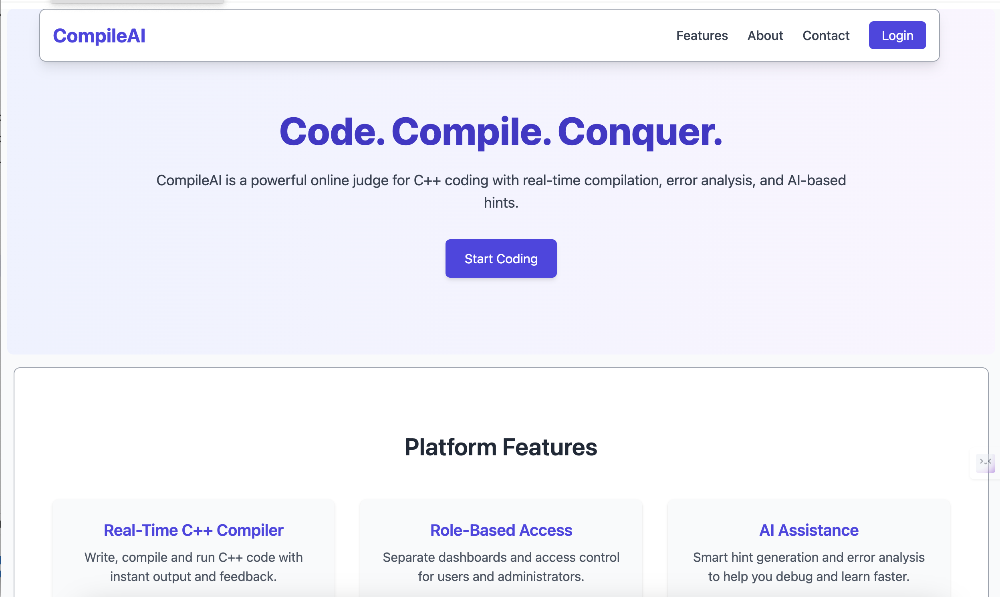
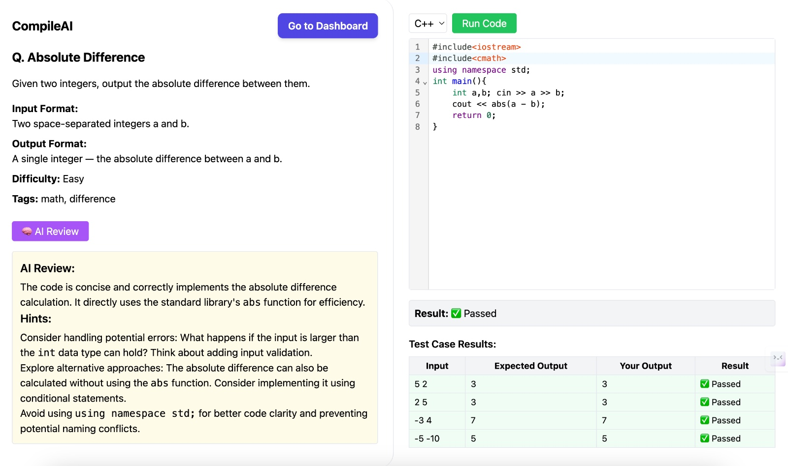
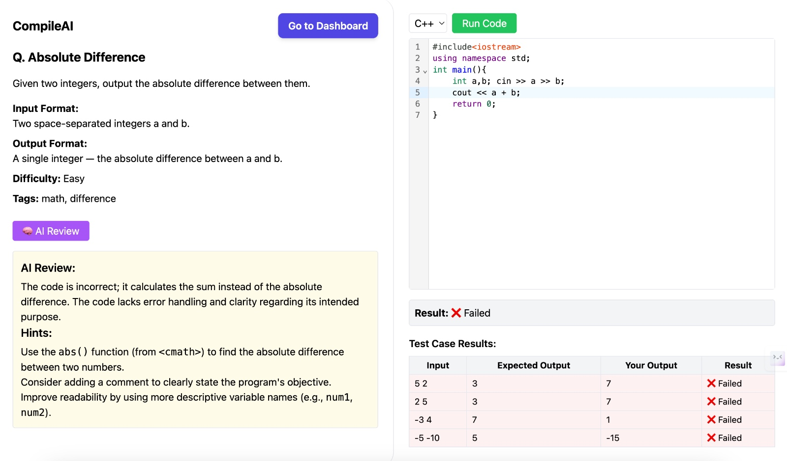

# CompileAI
An online judge platform for C++ programming — powered by MERN stack and AI assistance.

Compile AI is a full-stack MERN application designed to provide a competitive programming experience , AI integration to help users with hints and problem-solving intuition,doesnt provide code. this helps users get better at coding and problem solving and using AI with limits and not completely relying on it for DSA.

The platform is dockerized for easy deployment and scalability.
---

## Features

- ✅ Real-time C++ Compiler
- ✍️ Code Submission with Test Cases
- 🔒 Role-Based Authentication (Admin / User)
- 📜 Submission History & Detailed Status Tracking
- 🧠 AI-based Hint & Error Assistance 
- 📋 Admin Panel for Problem Management (CRUD)
- 📈 Responsive Modern UI with TailwindCSS
- 🔗 Navigation 

## Tech Stack
### Frontend
- React.js (Vite)
- Tailwind CSS
- Axios

### Backend
- Node.js
- Express.js
- MongoDB Atlas (Cloud DB)
- Mongoose ODM

### AI Integration
- Google Gemini API

### Other Tools
- Docker & Docker Compose (containerization)
- JWT Authentication
- bcrypt (password hashing)

### Project Structure
```
OJ_PROJECT/
├── backend/        
├── compiler/               
├── frontend/     
├── docker-compose.yml           
└── README.md   
```


### UI


### UI


### UI


### Contributing
Contributions are welcome! Please fork the repository and create a pull request.