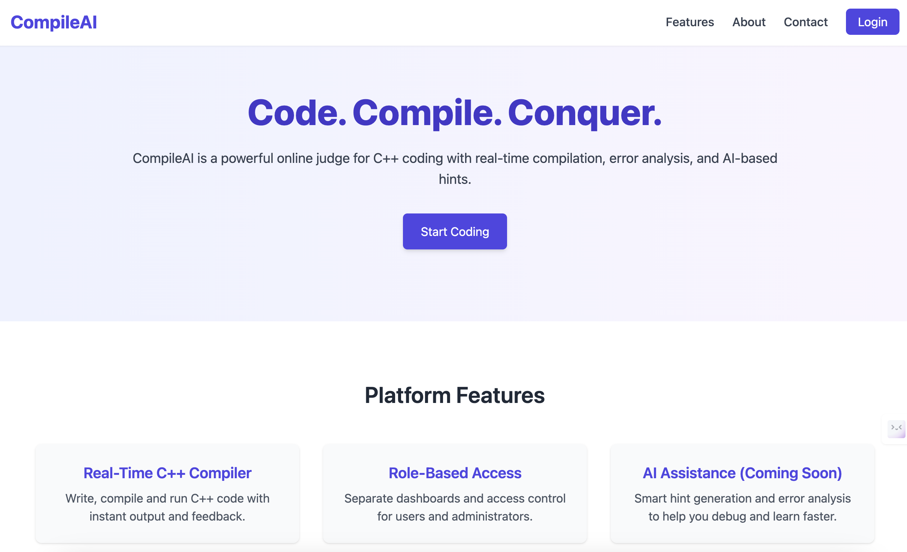

# CompileAI
An online judge platform for C++ programming — powered by MERN stack and AI assistance.

---

### UI

## Features

- ✅ Real-time C++ Compiler
- ✍️ Code Submission with Test Cases
- 🔒 Role-Based Authentication (Admin / User)
- 📜 Submission History & Detailed Status Tracking
- 🧠 AI-based Hint & Error Assistance (Planned)
- 📋 Admin Panel for Problem Management (CRUD)
- 📈 Responsive Modern UI with TailwindCSS
- 🔗 Navigation 